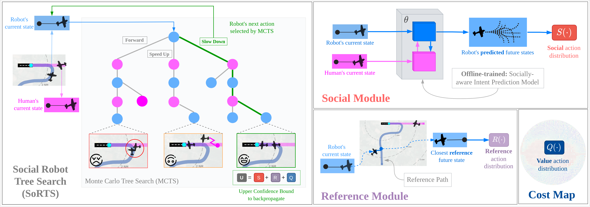
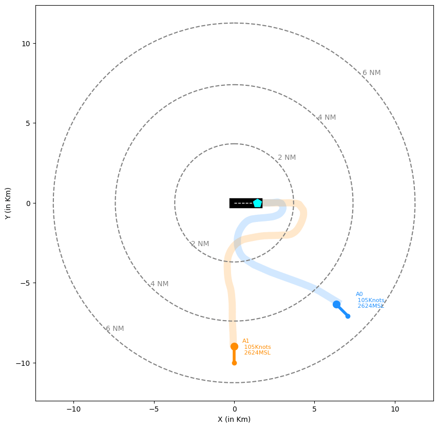
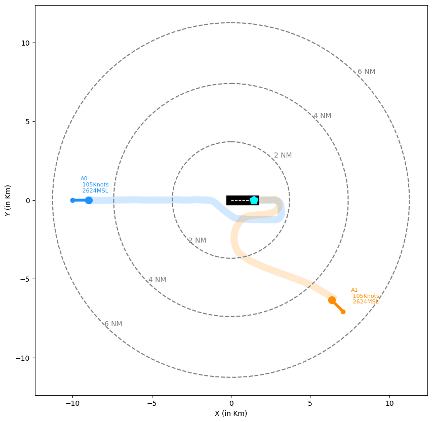

# Social Robot Tree Search (SoRTS)

This repository contains the code for the paper:

<h3> 
Learned Tree Search for Long-Horizon Social Robot Navigation in
Shared Airspace
</h3>

[Ingrid Navarro](https://navars.xyz) *, [Jay Patrikar](https://www.jaypatrikar.me) *, Joao P. A. Dantas, 
Rohan Baijal, Ian Higgins, [Sebastian Scherer](https://theairlab.org/team/sebastian/) and [Jean Oh](https://www.cs.cmu.edu/~./jeanoh/) 

*Equal contribution 

## Model Overview

Social Robot Tree Search (SoRTS) is an algorithm for the safe navigation of mobile robots in social 
domains. SoRTS aims to augment existing socially-aware trajectory prediction policies with a Monte 
Carlo Tree Search (MCTS) planner for improved downstream navigation of mobile robots. 
<p align="center">
  
</p>

## Installation

Setup a conda environment:
```
conda create --name sorts python=3.8
conda activate sorts
```

Download the repository and install requirements:
```
git clone --recurse-submodules git@github.com:cmubig/sorts.git
git submodule init 
git submodule update
pip install -e . 
```

## Setting up the repository

The ```data``` folder is structured as followed:
```
data/
├─ dataset
|   ├─ 111days1        
|   |   ├─ test
|   |   |   ├─ n.txt
|   |   |   ...
|   |   ├─ train
|   |   |   ├─ n.txt
|   |   |   ...
|   |   ├─ val
|   |   |   ├─ n.txt
|   |   |   ...
├─ sprnn
|   ├─ config.json
|   ├─ model.pth   
├─ dic2d.pkl
├─ traj_lib.txt
```

Below we describe the files contained within this folder. 

### Dataset 

This work leverages a subset of the [TrajAir](https://theairlab.org/trajair/) dataset consisting of 
111 days of aircraft trajectory data collected at the Pittsburgh-Butler Airport. You can download
the dataset following the instructions in [this](https://theairlab.org/trajair/) link. For more details
about the dataset, here's the original [paper](https://arxiv.org/pdf/2109.15158.pdf) and [code](https://github.com/castacks/trajairnet). 

Our code expects the dataset to be located within the ```data/dataset``` folder, in the format shown above. 

### SPRNN: Socially-aware intent prediction 

Our work uses an intent prediction algorithm to guide the tree search of the MCTS-based planner. 
We leverage the Social-Patternn (sprnn) algorithm whose configuration files and model checkpoint are located
within the ```data/sprnn``` folder. For more details about sprnn, here's the corresponding [paper](https://arxiv.org/pdf/2209.05649.pdf). The corresponding code is cloned and used as a submodule in ```game/social_policies```. 

### Other files

Our code also uses ```dic2d.pkl``` which is a dictionary of specified goal locations, and ```traj_lib.txt```, 
which is a file containing the set of motion primitives of the agent. 

## Running the code

To run our code you need to provide a configuration file specifying the parameters to run the planner, 
the social policy, the environment, visualization, etc. 

The configuration files to run SoRTS can be found in ```config/sorts```. For example, 
to run the two-agent experiment, run:
```
python run.py --exp config/sorts/2agent.json
```

The configuration files to run the baseline can be found in ```config/baseline```. For example, 
to run the two-agent experiment, run:
```
python run.py --exp config/baseline/2agent.json
```

## Results

This repo provides a socially-aware baseline and SoRTS, a socially-aware MCTS-based algorithm. Here
are the results from our self-play experiments. 

| Num Agents | Algorithms  | Success Rate  | Max Steps Reached  | Loss-Of-Separation  | Offtrack  | Reference Error |
|:-----:|:----------:|:----:|:----:|:----:|:----:|:----:|
| 2 | Baseline    | 0.710 | 0.250 | 0.000 | 0.050 | 19.34 |
|   | SoRTS       | 0.950 | 0.040 | 0.000 | 0.010 | 14.21 |

<table align="center">
  <tr>
    <td>Baseline</td>
    <td>SoRTS</td>
  </tr>
  <tr>
    <td></td>
    <td></td>
  </tr>
 </table>

## Citing

```
@inproceedings{navarro2023learned,
  title={Learned Tree Search for Long-Horizon Social Robot Navigation in Shared Airspace},
  author={Navarro Ingrid, Jay Patrikar, Joao P. A. Dantas, Rohan Baijal, Ian Higgins, Sebastian Scherer and Jean Oh},
  booktitle={Arxiv},
  year={2023}
 }
```